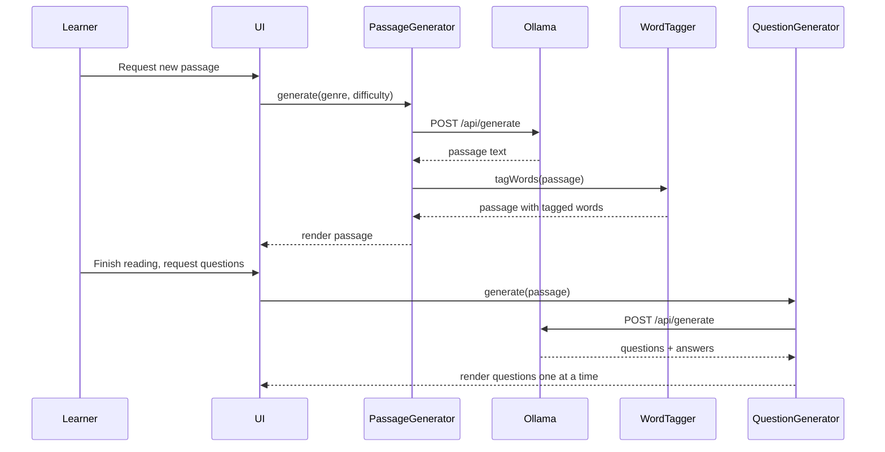

# Design Document: Dyslexia Comprehension Tool

## Overview

The Dyslexia Comprehension Tool is a web-based practice application for dyslexic children (ages 10–11, UK Year 6) preparing for 11+ English comprehension exams. It uses a local Ollama/Gemma LLM to dynamically generate reading passages and comprehension questions, reinforces vocabulary through motor-memory exercises, and presents everything in a dyslexia-friendly, anxiety-free interface.

The application is built as a single-page application (SPA) using React with TypeScript, persisting data to the browser's IndexedDB via a lightweight abstraction. The LLM integration runs through a local Ollama HTTP API, keeping all data on the user's machine with no cloud dependencies.

### Key Design Decisions

- **Local-first architecture**: All data stays on the learner's device. Ollama runs locally, and persistence uses IndexedDB. This avoids GDPR/child-data concerns entirely.
- **React + TypeScript SPA**: Chosen for component-based UI composition, strong typing, and broad ecosystem support (TTS via Web Speech API, fonts via CSS).
- **IndexedDB over localStorage**: Structured data (word bank entries, progress records, preferences) benefits from indexed queries and larger storage limits.
- **Web Speech API for TTS**: Built-in browser capability, no external dependencies. Supports rate adjustment and word-level events for highlighting.
- **OpenDyslexic font via CSS**: Loaded as a web font, applied globally with user-overridable preferences.
- **UK National Curriculum Year 5/6 statutory word list**: Embedded as a built-in reference (~100 words) that the Word_Tagger uses to identify curriculum-relevant vocabulary in passages.

## Architecture

The application follows a layered architecture with clear separation between UI, application logic, and data/external services.

```mermaid
graph TB
    subgraph UI Layer
        A[PassageView] --> B[ReadingRuler]
        A --> C[TTSControls]
        D[QuestionView] --> E[ScaffoldingHints]
        F[WordExerciseView]
        G[WordBankView]
        H[ProgressView]
        I[SettingsPanel]
    end

    subgraph Application Layer
        J[PassageGenerator]
        K[QuestionGenerator]
        L[WordTagger]
        M[MotorMemoryExercise]
        N[SpacedRepetitionScheduler]
        O[ProgressTracker]
        P[DifficultyManager]
        Q[DisplayPreferences]
    end

    subgraph Data / External Layer
        R[IndexedDB Store]
        S[Ollama HTTP Client]
        T[Web Speech API]
        U[Y5/6 Word List]
    end

    A --> J
    A --> L
    D --> K
    F --> M
    G --> N
    H --> O
    I --> Q
    A --> C --> T

    J --> S
    K --> S
    L --> U
    M --> R
    N --> R
    O --> R
    Q --> R
    P --> R
    P --> O
end
```

### Data Flow



## Components and Interfaces

### OllamaClient

Handles HTTP communication with the local Ollama instance.

```typescript
interface OllamaClient {
  generate(prompt: string, model?: string): Promise<string>;
  isAvailable(): Promise<boolean>;
}
```

- Base URL: `http://localhost:11434`
- Default model: `gemma:2b` (configurable)
- Timeout: 30 seconds per request
- Returns raw text response; callers parse as needed

### PassageGenerator

Constructs prompts and parses LLM output into structured passages.

```typescript
interface PassageGenerator {
  generate(genre: Genre, difficulty: DifficultyLevel, theme?: string): Promise<Passage>;
}

type Genre = 'fiction' | 'non-fiction' | 'poetry' | 'persuasive';
type DifficultyLevel = 1 | 2 | 3;
```

- Builds structured prompts specifying genre, difficulty, word count (150–500), paragraph length (≤4 sentences), and theme
- Validates output: word count within range, paragraph structure correct
- Falls back to friendly error message if Ollama is unavailable

### WordTagger

Identifies difficult vocabulary in a passage.

```typescript
interface WordTagger {
  tagWords(passage: Passage): TaggedWord[];
}

interface TaggedWord {
  word: string;
  definition: string;
  passageContext: string; // the sentence containing the word
  isCurriculumWord: boolean; // true if in Y5/6 statutory list
}
```

- Cross-references words against the built-in UK National Curriculum Year 5/6 statutory word list (~100 words including accommodate, aggressive, ancient, apparent, appreciate, attached, available, average, awkward, bargain, bruise, category, cemetery, committee, communicate, community, competition, conscience, conscious, controversy, convenience, correspond, criticise, curiosity, definite, desperate, determined, develop, dictionary, disastrous, embarrass, environment, equip, equipped, equipment, especially, exaggerate, excellent, existence, explanation, familiar, foreign, forty, frequently, government, guarantee, harass, hindrance, identity, immediate, immediately, individual, interfere, interrupt, language, leisure, lightning, marvellous, mischievous, muscle, necessary, neighbour, nuisance, occupy, occur, opportunity, parliament, persuade, physical, prejudice, privilege, profession, programme, pronunciation, queue, recognise, recommend, relevant, restaurant, rhyme, rhythm, sacrifice, secretary, shoulder, signature, sincere, sincerely, soldier, stomach, sufficient, suggest, symbol, system, temperature, thorough, twelfth, variety, vegetable, vehicle, yacht)
- Also identifies words above Year 6 reading level using word frequency/complexity heuristics
- Enforces 3–10 tagged words per passage
- Prioritises curriculum words when present

### QuestionGenerator

Generates comprehension questions via the LLM.

```typescript
interface QuestionGenerator {
  generate(passage: Passage): Promise<ComprehensionQuestion[]>;
}

interface ComprehensionQuestion {
  id: string;
  text: string;
  type: QuestionType;
  modelAnswer: string;
  hints: string[];        // graduated hints, ordered easiest to most revealing
  relevantSection: string; // passage excerpt for hint highlighting
}

type QuestionType = 'retrieval' | 'inference' | 'vocabulary' | 'authors-purpose' | 'summarisation';
```

- Produces 4–8 questions per passage
- Ensures mix of question types
- Each question includes 2–3 graduated hints and a model answer
- Answer evaluation uses LLM to compare learner answer against model answer, returning 'correct' | 'partial' | 'incorrect'

### MotorMemoryExercise

Manages the three-step word learning exercise.

```typescript
interface MotorMemoryExercise {
  start(word: TaggedWord): ExerciseSession;
}

interface ExerciseSession {
  step: 'type-three-times' | 'use-in-sentence' | 'type-from-memory' | 'complete';
  correctTypings: number; // 0–3 for first step
  submitTyping(input: string): ExerciseStepResult;
  submitSentence(sentence: string): ExerciseStepResult;
  submitMemoryRecall(input: string): ExerciseStepResult;
}

interface ExerciseStepResult {
  correct: boolean;
  feedback: string; // always encouraging
  nextStep: ExerciseSession['step'];
}
```

- Case-insensitive comparison for typing steps
- Sentence step accepts any sentence containing the target word (case-insensitive match)
- Memory recall step: word is hidden, learner types from memory
- On completion, word + definition + context are revealed and word is added to Word_Bank

### WordBankStore

Persistence layer for the personal word bank.

```typescript
interface WordBankStore {
  addWord(entry: WordBankEntry): Promise<void>;
  getAll(): Promise<WordBankEntry[]>;
  getDueForReview(): Promise<WordBankEntry[]>;
  updateReviewResult(wordId: string, recalled: boolean): Promise<void>;
  getMasteredCount(): Promise<number>;
}

interface WordBankEntry {
  id: string;
  word: string;
  definition: string;
  passageContext: string;
  addedDate: Date;
  nextReviewDate: Date;
  interval: number;       // days until next review
  easeFactor: number;     // SM-2 ease factor
  repetitions: number;    // successful consecutive recalls
  mastered: boolean;      // true when interval >= 21 days
}
```

### SpacedRepetitionScheduler

Implements the SM-2 algorithm for review scheduling.

```typescript
interface SpacedRepetitionScheduler {
  calculateNextReview(entry: WordBankEntry, recallQuality: number): ReviewUpdate;
}

interface ReviewUpdate {
  nextReviewDate: Date;
  newInterval: number;
  newEaseFactor: number;
  newRepetitions: number;
  mastered: boolean;
}
```

- Uses SM-2 algorithm: interval grows with successful recalls, resets on failure
- Recall quality: 0 (forgot) to 5 (perfect recall) — simplified to binary (recalled/not) for child UX
- Word is "mastered" when interval reaches 21+ days
- Initial intervals: 1 day, 3 days, then SM-2 formula

### ProgressTracker

Records and queries learner progress.

```typescript
interface ProgressTracker {
  recordPassageCompletion(passageId: string): Promise<void>;
  getCompletedCount(): Promise<number>;
  getCurrentStreak(): Promise<number>;
  getCompletionsAtDifficulty(level: DifficultyLevel): Promise<number>;
  shouldSuggestLevelUp(currentLevel: DifficultyLevel): Promise<boolean>;
}
```

- Streak: consecutive calendar days with at least one passage completed
- Level-up suggestion: triggered after 5 passages at current level with ≥60% questions answered correctly or partially correctly

### DifficultyManager

Manages difficulty level transitions.

```typescript
interface DifficultyManager {
  getCurrentLevel(): DifficultyLevel;
  setLevel(level: DifficultyLevel): void;
  suggestLevelChange(performance: PerformanceSnapshot): LevelSuggestion | null;
}

type LevelSuggestion = { direction: 'up' | 'down'; message: string };
```

- Defaults to level 1 on first use
- Learner can manually override at any time
- "Struggling" detection: <30% correct answers over last 3 passages at current level triggers gentle down-suggestion

### DisplayPreferences

Manages and persists user display settings.

```typescript
interface DisplayPreferences {
  get(): Promise<UserPreferences>;
  update(partial: Partial<UserPreferences>): Promise<void>;
}

interface UserPreferences {
  fontSize: number;          // px, default 18
  lineSpacing: number;       // multiplier, default 1.5
  backgroundColor: string;   // hex, default '#FFF8E7' (cream)
  fontFamily: string;        // default 'OpenDyslexic'
  readingRulerEnabled: boolean; // default true
  ttsSpeed: number;          // 0.5–2.0, default 0.85
}
```

### ReadingRuler (React Component)

```typescript
interface ReadingRulerProps {
  enabled: boolean;
  activeLineIndex: number;
  onLineChange: (lineIndex: number) => void;
}
```

- Renders a semi-transparent overlay dimming all lines except the active one
- Responds to click, tap, and keyboard (up/down arrow) events
- Persists enabled/disabled state via DisplayPreferences

### TTSController

Wraps the Web Speech API.

```typescript
interface TTSController {
  speak(text: string, startOffset?: number): void;
  pause(): void;
  resume(): void;
  stop(): void;
  setRate(rate: number): void;
  onWordBoundary: (callback: (charIndex: number) => void) => void;
}
```

- Uses `SpeechSynthesis` and `SpeechSynthesisUtterance`
- Word boundary events drive word-level highlighting in the UI
- Rate adjustable from 0.5× to 2.0×

## Data Models

### IndexedDB Schema

Database name: `dyslexia-comprehension-tool`

**Object Stores:**

| Store | Key | Indexes | Description |
|-------|-----|---------|-------------|
| `passages` | `id` (auto) | `genre`, `difficulty`, `createdAt` | Generated passages with metadata |
| `wordBank` | `id` (auto) | `word`, `nextReviewDate`, `mastered` | Personal vocabulary entries |
| `progress` | `id` (auto) | `date`, `passageId` | Passage completion records |
| `preferences` | `key` | — | Key-value store for user settings |

### Passage Record

```typescript
interface PassageRecord {
  id: string;
  text: string;
  genre: Genre;
  difficulty: DifficultyLevel;
  theme: string;
  paragraphs: string[];
  taggedWords: TaggedWord[];
  questions: ComprehensionQuestion[];
  createdAt: Date;
  completed: boolean;
  questionsAnswered: number;
  questionsCorrect: number;
}
```

### Progress Record

```typescript
interface ProgressRecord {
  id: string;
  passageId: string;
  date: string;          // ISO date string (YYYY-MM-DD)
  difficulty: DifficultyLevel;
  questionsTotal: number;
  questionsCorrect: number;
  questionsPartial: number;
  completedAt: Date;
}
```

### UK National Curriculum Year 5/6 Statutory Word List

Stored as a constant array in the application code (not in IndexedDB), used by the WordTagger:

```typescript
const YEAR_5_6_STATUTORY_WORDS: readonly string[] = [
  'accommodate', 'accompany', 'according', 'achieve', 'aggressive',
  'amateur', 'ancient', 'apparent', 'appreciate', 'attached',
  'available', 'average', 'awkward', 'bargain', 'bruise',
  'category', 'cemetery', 'committee', 'communicate', 'community',
  'competition', 'conscience', 'conscious', 'controversy', 'convenience',
  'correspond', 'criticise', 'curiosity', 'definite', 'desperate',
  'determined', 'develop', 'dictionary', 'disastrous', 'embarrass',
  'environment', 'equip', 'equipped', 'equipment', 'especially',
  'exaggerate', 'excellent', 'existence', 'explanation', 'familiar',
  'foreign', 'forty', 'frequently', 'government', 'guarantee',
  'harass', 'hindrance', 'identity', 'immediate', 'immediately',
  'individual', 'interfere', 'interrupt', 'language', 'leisure',
  'lightning', 'marvellous', 'mischievous', 'muscle', 'necessary',
  'neighbour', 'nuisance', 'occupy', 'occur', 'opportunity',
  'parliament', 'persuade', 'physical', 'prejudice', 'privilege',
  'profession', 'programme', 'pronunciation', 'queue', 'recognise',
  'recommend', 'relevant', 'restaurant', 'rhyme', 'rhythm',
  'sacrifice', 'secretary', 'shoulder', 'signature', 'sincere',
  'sincerely', 'soldier', 'stomach', 'sufficient', 'suggest',
  'symbol', 'system', 'temperature', 'thorough', 'twelfth',
  'variety', 'vegetable', 'vehicle', 'yacht'
] as const;
```

This list is sourced from the UK National Curriculum English Appendix 1 — the statutory spelling word list for Years 5 and 6. The WordTagger cross-references passage words against this list to prioritise curriculum-relevant vocabulary for tagging.


## Correctness Properties

*A property is a characteristic or behavior that should hold true across all valid executions of a system — essentially, a formal statement about what the system should do. Properties serve as the bridge between human-readable specifications and machine-verifiable correctness guarantees.*

### Property 1: Passage structure validation

*For any* passage returned by the PassageGenerator, the word count shall be between 150 and 500 inclusive, and every paragraph in the passage shall contain no more than 4 sentences.

**Validates: Requirements 1.4, 1.6**

### Property 2: Tagged word completeness

*For any* passage processed by the WordTagger, the number of tagged words shall be between 3 and 10 inclusive, and each tagged word shall have a non-empty definition and a non-empty passage context string.

**Validates: Requirements 2.2, 2.4**

### Property 3: Question generation structure

*For any* set of comprehension questions generated for a passage, the count shall be between 4 and 8 inclusive, at least 2 distinct question types shall be represented, and every question shall have a non-empty hints array with at least one hint and a non-empty relevantSection.

**Validates: Requirements 3.1, 3.2, 3.4**

### Property 4: Answer evaluation returns valid category

*For any* learner answer submitted for evaluation, the returned feedback shall be exactly one of 'correct', 'partial', or 'incorrect'.

**Validates: Requirements 3.3**

### Property 5: Motor memory exercise state machine

*For any* word, starting a MotorMemoryExercise and submitting 3 correct typings shall transition the exercise from 'type-three-times' to 'use-in-sentence'; submitting a valid sentence shall transition to 'type-from-memory'; and submitting a correct memory recall shall transition to 'complete' with the word's definition and context available.

**Validates: Requirements 4.1, 4.2, 4.3, 4.4**

### Property 6: Incorrect typing does not advance exercise

*For any* MotorMemoryExercise in any step, submitting an incorrect input shall keep the exercise at the same step with the same progress count, and the result shall indicate the error without penalty.

**Validates: Requirements 4.5**

### Property 7: Word bank addition round trip

*For any* word that has completed a MotorMemoryExercise, adding it to the WordBank and then retrieving all entries shall include that word with matching definition and passage context.

**Validates: Requirements 5.1**

### Property 8: Spaced repetition interval monotonicity

*For any* WordBankEntry, a sequence of consecutive successful recalls shall produce non-decreasing review intervals (each new interval ≥ the previous interval).

**Validates: Requirements 5.2**

### Property 9: Word bank sorted by review date

*For any* set of WordBankEntries, calling getAll() shall return them sorted by nextReviewDate in ascending order, with entries whose nextReviewDate ≤ now appearing before entries with future dates.

**Validates: Requirements 5.3**

### Property 10: Word bank query correctness

*For any* set of WordBankEntries, getDueForReview() shall return exactly those entries whose nextReviewDate ≤ the current date, and getMasteredCount() shall equal the count of entries where mastered === true.

**Validates: Requirements 5.4, 5.5**

### Property 11: Preference persistence round trip

*For any* valid UserPreferences object, calling update() and then get() shall return preferences reflecting all the updated values, including readingRulerEnabled.

**Validates: Requirements 6.5, 7.5**

### Property 12: TTS rate clamping

*For any* numeric rate value passed to setRate(), the effective rate shall be clamped to the range [0.5, 2.0].

**Validates: Requirements 8.4**

### Property 13: Progress recording round trip

*For any* passage completion recorded via recordPassageCompletion(), calling getCompletedCount() shall include that passage, and the corresponding ProgressRecord shall contain the correct passageId and today's date.

**Validates: Requirements 9.1**

### Property 14: Streak calculation correctness

*For any* sequence of ProgressRecords with completion dates, getCurrentStreak() shall return the length of the longest run of consecutive calendar days ending at today (or 0 if today has no completion).

**Validates: Requirements 9.2**

### Property 15: Previous passages always retrievable

*For any* passage that has been generated and stored, it shall remain retrievable by the Learner at any future point, regardless of subsequent actions.

**Validates: Requirements 10.5**

### Property 16: Difficulty suggestion correctness

*For any* DifficultyLevel and performance history, shouldSuggestLevelUp() shall return true when the learner has completed ≥5 passages at the current level with satisfactory comprehension; and suggestLevelChange() shall return a 'down' suggestion when the learner's recent performance at a level >1 falls below the struggling threshold.

**Validates: Requirements 11.3, 11.5**

## Error Handling

### Ollama Unavailability

- **Detection**: OllamaClient.isAvailable() checks connectivity before each generation request; generate() enforces a 30-second timeout.
- **User-facing response**: A friendly, non-alarming message: "We can't create a new passage right now. Why not revisit one you've already read?" with a link to the passage history.
- **No retry loops**: The tool does not auto-retry. The learner can manually request again when ready.

### LLM Output Validation Failures

- **Passage validation**: If the generated passage fails structural validation (word count out of range, paragraphs too long), the generator retries once with a refined prompt. On second failure, falls back to the Ollama-unavailable message.
- **Question validation**: If fewer than 4 questions are generated, the generator retries once. If still insufficient, presents whatever valid questions were produced (minimum 1).
- **Word tagging**: If fewer than 3 words are tagged, the tagger supplements from the Y5/6 statutory word list. If more than 10, it trims to the 10 most relevant (curriculum words prioritised).

### IndexedDB Errors

- **Storage full**: Display a message suggesting the learner clear old passages they no longer need.
- **Read failures**: Gracefully degrade — show empty state with a message rather than crashing.
- **Write failures**: Retry once, then inform the learner that progress couldn't be saved this time.

### Web Speech API Unavailability

- **Detection**: Check `window.speechSynthesis` existence on load.
- **Fallback**: Hide TTS controls entirely and show a subtle note that read-aloud isn't available in this browser.

### Invalid User Input

- **Motor memory exercise**: Case-insensitive comparison. Whitespace is trimmed. Empty submissions are silently ignored (no error shown).
- **Sentence step**: Any non-empty sentence containing the target word (case-insensitive) is accepted. If the word is missing, a gentle prompt: "Try using the word in your sentence."
- **Preferences**: Numeric inputs (font size, line spacing, TTS rate) are clamped to valid ranges rather than rejected.

## Testing Strategy

### Unit Tests

Unit tests cover specific examples, edge cases, and integration points:

- **PassageGenerator**: Test prompt construction for each genre; test validation rejects passages outside 150–500 words; test error fallback message when Ollama is unavailable.
- **WordTagger**: Test tagging against known passages with known Y5/6 words; test boundary cases (passage with exactly 3 taggable words, passage with >10).
- **QuestionGenerator**: Test that output parsing handles well-formed and malformed LLM responses.
- **MotorMemoryExercise**: Test each step transition with specific correct/incorrect inputs; test case-insensitivity.
- **SpacedRepetitionScheduler**: Test SM-2 calculations with known input/output pairs; test mastery threshold at 21 days.
- **ProgressTracker**: Test streak calculation with specific date sequences (consecutive days, gaps, single day).
- **DifficultyManager**: Test level-up suggestion at exactly 5 completions; test struggle detection at boundary.
- **DisplayPreferences**: Test default values match spec (cream background, 1.5× spacing, OpenDyslexic font).
- **TTSController**: Test rate clamping at boundaries (0.5, 2.0, below 0.5, above 2.0).

### Property-Based Tests

Property-based tests verify universal properties across randomised inputs. Each property test maps to a Correctness Property from this design document.

- **Library**: [fast-check](https://github.com/dubzzz/fast-check) for TypeScript
- **Minimum iterations**: 100 per property test
- **Tag format**: Each test is annotated with a comment: `// Feature: dyslexia-comprehension-tool, Property {N}: {title}`

| Property | Test Description |
|----------|-----------------|
| P1 | Generate random passage text, validate word count ∈ [150, 500] and all paragraphs ≤ 4 sentences |
| P2 | Generate random passages, run WordTagger, assert 3–10 tagged words each with non-empty definition and context |
| P3 | Generate random question sets, assert count ∈ [4, 8], ≥2 types, all hints non-empty |
| P4 | Generate random answer submissions, assert evaluation result ∈ {'correct', 'partial', 'incorrect'} |
| P5 | Generate random words, run full exercise flow, assert correct state transitions |
| P6 | Generate random words and incorrect inputs, assert exercise does not advance |
| P7 | Generate random words, complete exercise, assert word appears in WordBank with correct data |
| P8 | Generate random WordBankEntries, simulate consecutive successful recalls, assert intervals are non-decreasing |
| P9 | Generate random WordBankEntries with various review dates, assert getAll() returns sorted order |
| P10 | Generate random WordBankEntries, assert getDueForReview() and getMasteredCount() match expected |
| P11 | Generate random UserPreferences, update then get, assert round-trip equality |
| P12 | Generate random numeric rates, assert effective rate ∈ [0.5, 2.0] |
| P13 | Generate random passage completions, assert retrievable with correct date |
| P14 | Generate random date sequences, assert streak calculation matches expected consecutive-day count |
| P15 | Generate random passages, store them, assert all remain retrievable after further operations |
| P16 | Generate random performance histories, assert level-up/down suggestions fire at correct thresholds |

### Test Organisation

```
src/
  __tests__/
    unit/
      passageGenerator.test.ts
      wordTagger.test.ts
      questionGenerator.test.ts
      motorMemoryExercise.test.ts
      spacedRepetition.test.ts
      progressTracker.test.ts
      difficultyManager.test.ts
      displayPreferences.test.ts
      ttsController.test.ts
    property/
      passageStructure.property.test.ts
      wordTagging.property.test.ts
      questionGeneration.property.test.ts
      exerciseStateMachine.property.test.ts
      wordBank.property.test.ts
      spacedRepetition.property.test.ts
      preferences.property.test.ts
      progress.property.test.ts
      difficulty.property.test.ts
```
